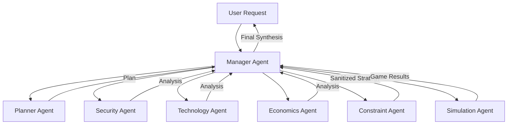

# Diplomatic Simulation Agent 🌍

> **Agentic orchestration system using Gen AI to simulate negotiations beforehand.**

An advanced multi-agent system designed to model, analyze, and simulate complex strategic scenarios between abstract actors. Built with **Google Vertex AI (Gemini 2.5)**, **LangGraph**, and **Streamlit**.


---

## 🚀 Overview

This system allows you to define a scenario (e.g., "Trade Agreement under Inflation") and a set of actors (A, B, C). It then orchestrates a team of AI specialist agents to decompose the problem, analyze it from multiple angles (Security, Tech, Economics), enforce ethical constraints, and run a game-theoretic simulation to predict outcomes.

### Core Capabilities
*   **Strategic Planning**: Decomposes complex requests into actionable analysis steps.
*   **Multi-Perspective Analysis**: Dedicated agents for Security, Technology, and Economics.
*   **Ethical Constraints**: A dedicated Constraint Agent ensures recommendations are safe and grounded.
*   **Simulation**: Runs a turn-based negotiation simulation to test strategy robustness.
*   **Interactive UI**: A modern Streamlit interface for configuration and result visualization.

---

## 🏗️ Architecture

The system follows a hub-and-spoke orchestration model, ending with a sequential simulation loop.



---

## 🛠️ Installation

### Prerequisites
*   **Python 3.12+**
*   **Google Cloud Project** with Vertex AI API enabled.

### setup

1.  **Clone the repository**:
    ```bash
    git clone https://github.com/your-repo/diplomatic-simulation.git
    cd diplomatic-simulation
    ```

2.  **Install dependencies**:
    ```bash
    pip install .
    ```

3.  **Configure Environment**:
    Create a `.env` file in the root directory:
    ```env
    GOOGLE_CLOUD_PROJECT=your-project-id
    VERTEX_AI_LOCATION=us-central1
    # Optional: LangSmith for tracing
    LANGCHAIN_TRACING_V2=true
    LANGCHAIN_API_KEY=your-langchain-key
    ```

---

## 🖥️ Usage

### 1. Interactive Web UI (Recommended)
The easiest way to run simulations.

```bash
streamlit run ui/app.py
```

*   **Configure**: Set max turns, global context, and define your actors in the sidebar.
*   **Run**: Type your request (e.g., "Analyze a resource sharing treaty") and hit Run.
*   **Analyze**: View the Strategic Plan, Specialist findings, and the final Game-Theoretic Simulation results in real-time.

### 2. API Server
Run the backend as a FastAPI service.

```bash
python scripts/run_server.py
```
*   Endpoint: `POST /analyze`

### 3. CLI Mode
Run a quick test with the default scenario.

```bash
python scripts/run_local.py
```

---

## 🤖 Agent Roles

| Agent | Model | Role |
| :--- | :--- | :--- |
| **Manager** | Orchestrator | Coordinates the pipeline and synthesizes the final answer. |
| **Planner** | Gemini 2.5 Pro | Breaks down the user request into specialist tasks. |
| **Security** | Gemini 2.5 Flash | Analyzes geopolitical risks, alliances, and stability. |
| **Technology**| Gemini 2.5 Flash | Assesses technical feasibility and leverage points. |
| **Economics** | Gemini 2.5 Flash | Evaluates incentives, costs, and trade-offs. |
| **Constraint**| Gemini 2.5 Pro | Enforces safety, ethics, and logical coherence. |
| **Simulation**| Gemini 2.5 Pro | Runs comparative game-theoretic scenarios. |

---

## 📂 Project Structure

```text
diplomatic-simulation/
├── agents/             # Agent implementations (ADK + Logic)
├── configs/            # Scenario YAML configurations
├── llm/                # Vertex AI client wrapper
├── orchestration/      # FastAPI and App wiring
├── scripts/            # Entry points (CLI, Server)
├── ui/                 # Streamlit application
├── workflows/          # LangGraph simulation logic
├── pyproject.toml      # Project metadata & dependencies
└── README.md           # Documentation
```
