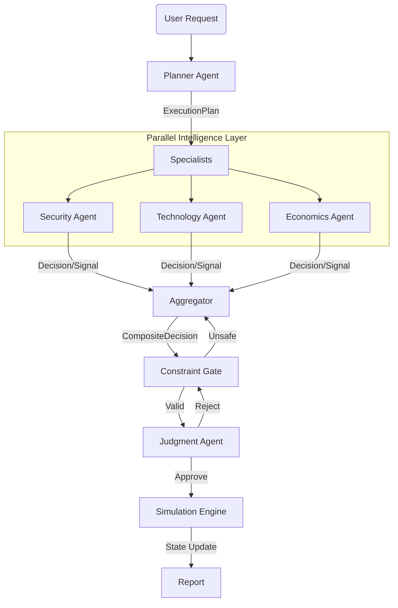

# 🌍 Diplomatic Simulation Agent `v0.2.1`

> **Enterprise-Grade Multi-Agent Strategic Simulation System**
>
> *Powered by Groq `gpt-oss-120b` & `gpt-oss-20b`*


An advanced agentic architecture designed to model, analyze, and simulate complex geopolitical scenarios. Unlike standard chatbots, this system employs a **Decision-Centric** architecture where agents communicate via strictly typed Pydantic objects, ensuring deterministic control flow and rigorous safety.

---

## ⚡ What's New in v0.2.1

### 🛡️ **Epistemic Resilience & Intelligence Salvage**
The system now possesses "Cognitive Recovery" capabilities. If a specialist agent produces malformed output (e.g., broken JSON), the system doesn't crash or discard the data. Instead:
1.  **Intercepts** the raw thought stream.
2.  **Salvages** semantic signals using a fast extraction layer.
3.  **Synthesizes** a valid risk signal from the noise.
> *Result: The system thinks even when it stutters.*

### 🧱 **Adaptive Fault Tolerance**
A strict semantic firewall now separates **System Faults** (timeouts, API errors) from **Strategic Risks**.
- **Degraded Mode**: If intelligence is partial, the system automatically shifts to a conservative "Safe Mode" (Risk 0).
- **Consensus Abort**: A single hallucinating agent cannot trigger an ABORT. We require a quorum of high-confidence, high-risk signals.

### 🧠 **Visible Thinking**
Watch the "Inner Monologue" of every agent in real-time via the new **Thought Stream** UI.

---

## 🏗️ Architecture

The system uses a directed cyclic graph (LangGraph) to orchestrate a pipeline of specialist agents.



### Core Components
| Component | Function | Model Used |
|-----------|----------|------------|
| **Planner** | Decomposes abstract strategy into tactical steps | `openai/gpt-oss-120b` |
| **Specialists** | Domain-specific analysis (Security, Tech, Econ) | `openai/gpt-oss-20b` |
| **Aggregator** | Deterministic fusion of Decisions & Salvaged Signals | *Code-Based* |
| **Constraint** | Asimov-style safety & ethics validation gates | `openai/gpt-oss-120b` |
| **Judgment** | "First Principles" feasibility check | `openai/gpt-oss-120b` |
| **Simulation** | Game-theoretic outcome projection | `openai/gpt-oss-120b` |

---

## 🚀 Quick Start

### Prerequisites
- Python 3.12+
- Docker (Optional)
- **Groq API Key** (Required)

### 1. Installation
```bash
git clone https://github.com/your-org/simulation-agent.git
cd simulation-agent
python3 -m venv .venv
source .venv/bin/activate
pip install -r requirements.txt
```

### 2. Configuration
Create a `.env` file:
```env
GROQ_API_KEY=gsk_your_key_here
```

### 3. Run the Dashboard
```bash
streamlit run ui/app.py
```
*Access the UI at `http://localhost:8501`*

---

## 🧪 Testing & Verification

The repository includes a hardened test suite to verify the fault tolerance mechanisms.

```bash
# Run full regression suite
pytest tests/

# Test specific agent resilience
pytest tests/test_resilience.py
```

---

## 📂 Project Structure

```text
simulation-agent/
├── agents/             # Specialist Agents (The "Brain")
├── core/               # Pydantic Schemas & Aggregation Logic
├── llm/                # Hardened LLM Client (w/ Markdown Stripper)
├── orchestration/      # LangGraph Workflow Definition
├── ui/                 # Streamlit Interface (w/ Event Loop)
└── tests/              # Resilience Tests
```

---

### 📜 License
MIT License. See `LICENSE` for details.

---

**Built with Groq Speed.**
