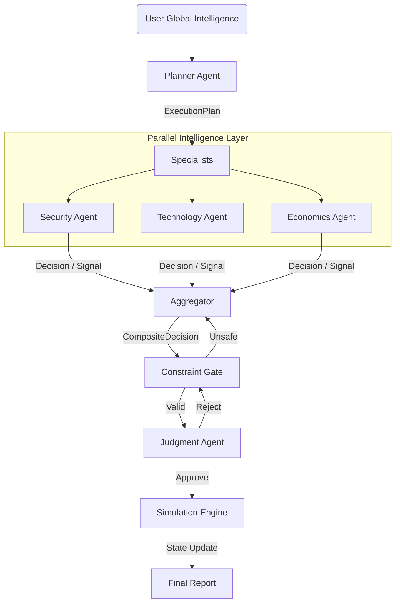

# 🌍 Diplomatic Simulation Agent `v0.2.1`

> **Enterprise-Grade Strategic Simulation Architecture**
>
> *Designed for Adaptive Fault Tolerance & Epistemic Resilience*


An advanced multi-agent system designed to model, analyze, and simulate complex geopolitical scenarios. This repository implements a **Decision-Centric** architecture where agents communicate via strictly typed Pydantic objects (`Decision`, `Signal`), ensuring deterministic control flow and rigorous safety.

---

## 🏗️ Architecture & Model Strategy

This system implements a tiered model strategy to balance cost, speed, and reasoning depth.

### **Production vs. Testing Strategy**
| Environment | Provider | Model | Use Case |
|-------------|----------|-------|----------|
| **Testing / Dev** | **Groq** | `gpt-oss-120b` / `20b` | **Low Cost & High Speed**. Used for rapid iteration, unit testing, and high-volume simulation runs where latency and cost efficiency are paramount. |
| **Production** | **Google Gemini** | `gemini-2.5-pro` | **High Fidelity**. Reserved for live deployment requiring maximum context window (1M+ tokens), multi-modal reasoning, and highest-grade diplomatic nuance. |

> **Note**: The repository is currently configured for **Groq (Testing Mode)** by default to ensure accessible development.

---

## ⚡ Key Features (v0.2.0)

### 1. 🛡️ Adaptive Fault Tolerance
We enforce a **Semantic Firewall** between System Faults and Strategic Risks.
- **Strict Separation**: API timeouts or Schema errors are never conflated with "High Risk".
- **Degraded Mode**: If the system loses contact with specialist agents (Zero Decisions), it automatically fails over to a **neutral risk stance** (Risk 0) rather than crashing or hallucinating a crisis.
- **Consensus Abort**: A single agent cannot trigger a mission abort. A quorum of ≥2 high-confidence, high-risk signals is required.

### 2. 🧠 Epistemic Resilience (Intelligence Salvage)
The system possesses "Cognitive Recovery" capabilities. 
- **The Problem**: High-speed LLMs sometimes fail strict JSON schemas.
- **The Solution**: Instead of discarding malformed output, the **Orchestrator** intercepts the proper raw text, uses a fast recovery model to **salvage** semantic signals (e.g., "Risk Increasing"), and feeds this "Soft Intelligence" into the decision engine.
- **Result**: The system "thinks" even when it stutters.

### 3. 👁️ Visible Thinking
Every agent's cognitive process is transparent. The **Thought Stream** UI displays the instantaneous "Inner Monologue" of security, economic, and technology specialists before they commit to a formal decision.

---

## 🧩 System Components

The architecture is orchestrated via a directed cyclic graph (**LangGraph**).



### Repository Structure
| Directory | Description |
|-----------|-------------|
| `agents/` | **The Brains**. Contains `SecurityAgent`, `EconomicsAgent`, etc. Each inherits from `BaseAgent` and implements strict typed interfaces. |
| `core/` | **The Laws**. Defines Pydantic schemas (`schemas.py`) and the `DecisionAggregator` logic. This is the deterministic kernel of the system. |
| `orchestration/` | **The Nervous System**. `graph.py` defines the LangGraph workflow, nodes, and state transitions. `manager_run.py` handles the async loop. |
| `llm/` | **The Mouth**. `llm_client.py` handles API communication, retries, and the **JSON Markdown Stripper** for resilience. |
| `ui/` | **The Face**. A reactive Streamlit dashboard (`app.py`) with specialized components (`components.py`) for rendering decisions, timelines, and thought streams. |

---

## 🚀 Getting Started

### Prerequisites
- Python 3.12+
- Groq API Key (for Development/Testing)

### Installation

1.  **Clone & Setup**
    ```bash
    git clone https://github.com/your-org/simulation-agent.git
    cd simulation-agent
    python3 -m venv .venv
    source .venv/bin/activate
    pip install -r requirements.txt
    ```

2.  **Environment**
    Create a `.env` file:
    ```env
    GROQ_API_KEY=gsk_...
    ```

3.  **Run the Dashboard**
    ```bash
    streamlit run ui/app.py
    ```

---

## 🧪 Testing

The system includes a production-hardened test suite.

```bash
# Run all tests
pytest tests/

# Test LLM Client Resilience (Retries, JSON Stripping)
pytest tests/test_llm_client.py
```

---

### 📜 License
MIT License.
