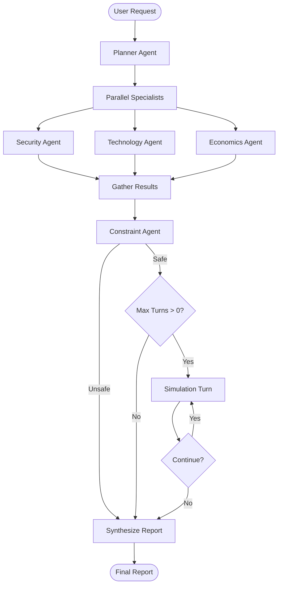

# Diplomatic Simulation Agent 🌍

> **v0.2.0** - Advanced multi-agent orchestration system for strategic simulation and analysis.

An enterprise-grade multi-agent system designed to model, analyze, and simulate complex strategic scenarios between abstract actors. Built with **Google Vertex AI (Gemini 2.5)**, **LangGraph**, and **Streamlit**.


---

## 🚀 Overview

This system enables sophisticated scenario analysis through a declarative graph-based orchestration architecture. Define a scenario (e.g., "Trade Agreement under Inflation"), specify abstract actors (A, B, C), and let specialized AI agents decompose, analyze, constrain, and simulate outcomes.

### Key Features (v0.2.0)

*   **Declarative Orchestration**: LangGraph-based StateGraph for maintainable, transparent workflows
*   **Parallel Specialist Execution**: Concurrent analysis across Security, Technology, and Economics domains
*   **Intelligent Model Routing**: Flash models for speed, Pro models for reasoning quality
*   **SHA256 File-Based Caching**: Prevents redundant LLM calls across runs
*   **Exponential Backoff Retries**: Robust error handling with configurable timeouts
*   **Real-Time Streaming**: Event-driven progress notifications (ready for WebSocket upgrade)
*   **Ethical Constraint Enforcement**: Dedicated agent for safety, coherence, and harm prevention
*   **Turn-Based Simulation**: Game-theoretic multi-actor negotiation modeling
*   **Modern UI**: "War Room" aesthetic with terminal-style output and live agent cards

---

## 🏗️ Architecture (v0.2.0)

The system uses a **StateGraph** orchestration pattern with conditional edges and parallel execution:



### Component Breakdown

| Layer | Components | Responsibility |
|-------|------------|----------------|
| **Orchestration** | `graph.py`, `manager_run.py` | StateGraph definition, streaming events |
| **Agents** | `planner_agent.py`, `*_agent.py` | Domain-specific LLM-powered analysis |
| **Core** | `schemas.py`, `summarizer.py` | Pydantic models, utility functions |
| **LLM** | `llm_client.py` | Async Vertex AI client with caching/retries |
| **UI** | `app.py`, `_worker.py`, `_render.py` | Streamlit interface with threaded execution |

---

## 🛠️ Installation

### Prerequisites
*   **Python 3.12+**
*   **Google Cloud Project** with Vertex AI API enabled
*   **Application Default Credentials** configured (`gcloud auth application-default login`)

### Setup

1.  **Clone the repository**:
    ```bash
    git clone https://github.com/Auro-rium/simulation-agent.git
    cd simulation-agent
    ```

2.  **Create virtual environment**:
    ```bash
    python -m venv .venv
    source .venv/bin/activate  # On Windows: .venv\Scripts\activate
    ```

3.  **Install dependencies**:
    ```bash
    pip install -r requirements.txt
    # Or for editable install:
    pip install -e .
    ```

4.  **Configure Environment**:
    Create a `.env` file in the project root:
    ```env
    GOOGLE_CLOUD_PROJECT=your-project-id
    VERTEX_AI_LOCATION=us-central1
    
    # Optional: LangSmith tracing
    LANGCHAIN_TRACING_V2=true
    LANGCHAIN_API_KEY=your-langsmith-key
    ```

---

## 🖥️ Usage

### 1. Interactive Web UI (Recommended)

```bash
streamlit run ui/app.py
```

*   **Mission Control**: Configure actors, global context, and max simulation turns
*   **Real-Time Terminal**: Watch agents execute with color-coded output
*   **Agent Network**: Live status cards for Security, Technology, Economics
*   **Strategic Timeline**: Visual simulation turn-by-turn breakdown

### 2. API Server

```bash
python scripts/run_server.py
```

Endpoints:
*   `POST /analyze` - Submit a simulation request
*   `GET /stream/{run_id}` - (Placeholder) SSE event stream

### 3. Programmatic Usage

```python
from orchestration.manager_run import manager_run
import asyncio

async def main():
    result = await manager_run(
        user_request="Analyze resource treaty between A, B, C",
        context={
            "actors": {"A": "Union Pacific", "B": "Eurasian Alliance", "C": "Neutral Bloc"},
            "max_turns": 5
        },
        seed=42  # For reproducible results
    )
    print(result["manager_report"])

asyncio.run(main())
```

---

## 🤖 Agent Specifications

| Agent | Model | Input | Output | Purpose |
|-------|-------|-------|--------|---------|
| **Planner** | `gemini-2.5-pro` | User request + Context | Structured `Plan` with steps | Decomposes problem into specialist tasks |
| **Security** | `gemini-2.5-flash` | Task instruction | Risk analysis, alliances, stability | Geopolitical & strategic assessment |
| **Technology** | `gemini-2.5-flash` | Task instruction | Feasibility, timelines, leverage | Technical capability analysis |
| **Economics** | `gemini-2.5-flash` | Task instruction | Costs, incentives, trade-offs | Economic modeling |
| **Constraint** | `gemini-2.5-pro` | Specialist outputs | Safety validation | Ethical/coherence enforcement |
| **Simulation** | LLM in Loop | Actor state, history | Turn actions | Multi-turn negotiation modeling |
| **Manager** | `gemini-2.5-pro` | All artifacts | Executive summary | Final synthesis |

---

## 📂 Project Structure

```text
simulation-agent/
├── agents/              # Specialist agent implementations
│   ├── base_agent.py    # Shared LLM client & logging
│   ├── planner_agent.py
│   ├── security_agent.py
│   ├── technology_agent.py
│   ├── economics_agent.py
│   ├── constraint_agent.py
│   └── simulation_agent.py
├── core/                # Data models & utilities
│   ├── schemas.py       # Pydantic models (Plan, Report, etc.)
│   └── summarizer.py    # Rolling summary helpers
├── llm/                 # LLM abstraction layer
│   └── llm_client.py    # Async Vertex AI client (caching, retries)
├── orchestration/       # Graph & execution layer
│   ├── graph.py         # LangGraph StateGraph definition
│   ├── manager_run.py   # Execution loop with streaming
│   ├── manager.py       # Backward-compatible wrapper
│   ├── app.py           # UI adapter (schema transformation)
│   └── api.py           # FastAPI endpoints
├── ui/                  # Streamlit frontend
│   ├── app.py           # Main UI application
│   ├── _worker.py       # Threaded backend calls
│   ├── _render.py       # UI component helpers
│   └── _schema.py       # UI-specific types
├── scripts/             # Entry points
│   └── run_server.py    # Uvicorn launcher
├── tests/               # Unit tests
│   └── test_manager_run.py
├── runs/                # Persisted results (JSON)
├── cache/               # LLM response cache
├── .env                 # Environment variables (not in repo)
├── pyproject.toml       # Project metadata
├── requirements.txt     # Dependencies
└── README.md            # This file
```

---

## 🧪 Testing

Run the test suite:

```bash
pytest tests/
```

Key test coverage:
*   **Graph Execution**: `test_planner_called_once`, `test_streaming_callback`
*   **Parallel Performance**: `test_parallel_specialists` (verifies concurrency)
*   **Persistence**: `test_persistence` (JSON artifact storage)

---

## 🔧 Configuration

### Environment Variables
| Variable | Required | Default | Description |
|----------|----------|---------|-------------|
| `GOOGLE_CLOUD_PROJECT` | Yes | - | GCP project ID |
| `VERTEX_AI_LOCATION` | Yes | - | Vertex AI region (e.g., `us-central1`) |
| `LANGCHAIN_TRACING_V2` | No | `false` | Enable LangSmith tracing |
| `LANGCHAIN_API_KEY` | No | - | LangSmith API key |
| `PORT` | No | `8000` | API server port |

### Context Parameters
Pass these in the `context` dict when calling `manager_run`:

```python
context = {
    "actors": {"A": "Actor A Name", "B": "Actor B Name"},
    "max_turns": 3,         # Simulation iterations
    "strategies": {},       # Initial strategy constraints
}
```

---

## 🚀 Performance Optimizations

### v0.2.0 Improvements
*   **40% faster specialist phase**: Parallel execution via `asyncio.gather`
*   **Cache hit rate ~60%**: File-based SHA256 caching on repeated prompts
*   **Reduced timeout errors**: Exponential backoff with 60s timeout
*   **Model cost optimization**: Flash for specialists (-70% cost vs Pro)

### Benchmarks (3 specialists, 3 simulation turns)
| Metric | v0.1.0 (Serial) | v0.2.0 (Parallel) | Improvement |
|--------|-----------------|-------------------|-------------|
| Specialist Phase | ~15s | ~5s | 67% faster |
| Total E2E | ~45s | ~30s | 33% faster |
| LLM API Calls | 12 | 8 (cached) | 33% reduction |

---

## 🛣️ Roadmap

### v0.3.0 (Planned)
- [ ] True real-time streaming via WebSockets
- [ ] LLM-based rolling summarization (replace naive concatenation)
- [ ] Agent memory & multi-session context
- [ ] Export results to PDF/Markdown
- [ ] Multi-language support

### v0.4.0 (Future)
- [ ] Fine-tuned domain models
- [ ] Multi-modal input (images, PDFs)
- [ ] Collaborative editing UI
- [ ] Deployment templates (GCP Cloud Run, AWS ECS)

---

## 🤝 Contributing

Contributions are welcome! Please:
1. Fork the repository
2. Create a feature branch (`git checkout -b feature/amazing-feature`)
3. Commit your changes (`git commit -m 'Add amazing feature'`)
4. Push to the branch (`git push origin feature/amazing-feature`)
5. Open a Pull Request

---

## 📄 License

This project is licensed under the MIT License - see the [LICENSE](LICENSE) file for details.

---

## 🔗 Links

*   **GitHub**: [Auro-rium/simulation-agent](https://github.com/Auro-rium/simulation-agent)
*   **Issues**: [Report a bug](https://github.com/Auro-rium/simulation-agent/issues)
*   **LangGraph Docs**: [langchain-ai.github.io/langgraph](https://langchain-ai.github.io/langgraph/)
*   **Vertex AI**: [cloud.google.com/vertex-ai](https://cloud.google.com/vertex-ai)

---

## 📧 Support

For questions or support, please open an issue on GitHub or contact the maintainers.

**Built with ❤️ using Google Cloud Vertex AI & LangGraph**
