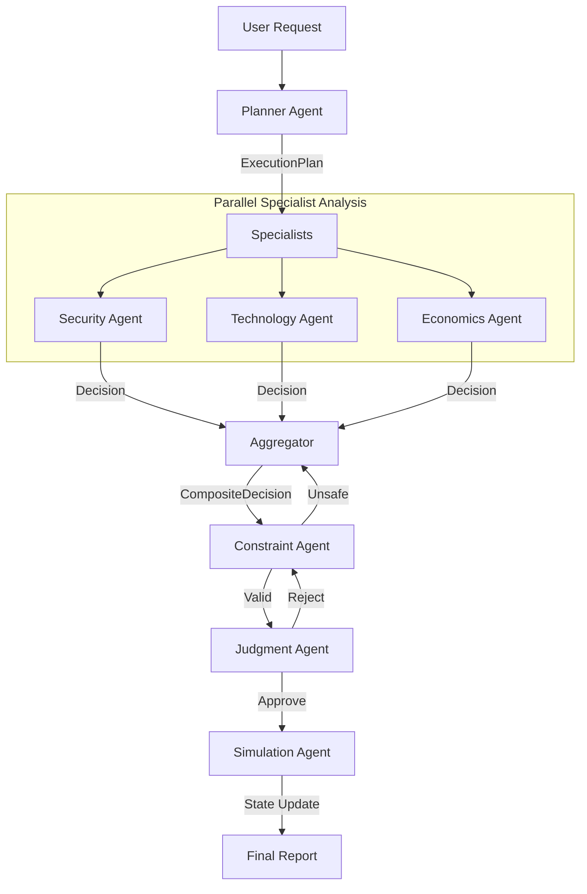

# Diplomatic Simulation Agent 🌍 (v0.3.1 Production)

> **HARDENED PRODUCTION SYSTEM**: Features Strict Typed Decisions, Deterministic Aggregation, and Enforced LLM Safety/Token Budgets.

An enterprise-grade multi-agent system designed to model, analyze, and simulate complex strategic scenarios between abstract actors. Built with **Groq (Llama 3)**, **LangGraph**, and **Streamlit**.


## 🚀 Quick Start

### 1. Installation
```bash
python3 -m venv .venv
source .venv/bin/activate
pip install -r requirements.txt
```

### 2. Configuration
Create a `.env` file:
```env
# Required for LLM
GROQ_API_KEY=gsk_...

# Optional Observability
LANGCHAIN_TRACING_V2=true
LANGCHAIN_API_KEY=lsv2_...
```

### 3. Run the UI
```bash
streamlit run ui/app.py
```

---

### 🧠 **Real Scenario Input**
Copy-paste this into the **Global Intelligence** field in the UI to see the agents in action:

> **Scenario: The Arctic Melt Standoff (2032)**
> 
> The Arctic sea ice has receded faster than predicted, opening the Northern Sea Route permanently. 
> **Actor A (The User)**: The "Nordic Alliance" wants to declare the route an international preservation zone, banning heavy military traffic.
> **Actor B**: The "Eurasian Energy Bloc" claims sovereignty and has moved drilling platforms into disputed waters.
> **Actor C**: The "Trans-Atlantic Trade Union" stays neutral but demands free passage for cargo ships.
> 
> **Crisis**: A Nordic Alliance drone was shot down near a Eurasian oil rig yesterday. Tensions are at DEFCON 3.

---

### 🧠 Architecture (v0.4.1)
The system employs a **Decision-Centric** architecture where agents exchange typed Pydantic objects (`Decision`, `ExecutionPlan`) rather than free text.

### Core Components
*   **LLM Client**: Hardened client using **Groq** for ultra-low latency.
    *   **Reasoning Model**: `llama-3.3-70b-versatile` (Planning, Judgment, Simulation)
    *   **Fast Model**: `llama-3.1-8b-instant` (Specialist Analysis)
    *   **Strict JSON**: Enforced via Groq `json_object` mode.
    *   **Caching**: Deterministic caching in `cache/` to prevent re-running identical queries.

*   **Orchestration**: `ManagerAgent` coordinates the pipeline:
    1.  **Planner**: Decomposes request into parallel sub-tasks.
    2.  **Specialists**: Security, Economics, Technology agents run in parallel.
    3.  **Constraint**: Validates specialist outputs against safety/ethics rules.
    4.  **Judgment**: Evaluates the plan's feasibility (First Principles).
    5.  **Simulation**: Runs a game-theoretic simulation of the approved strategy.



### Key Components
1.  **Typed Decisions**: Agents output `Decision(type=APPROVE, risk_score=8, ...)` objects.
2.  **Deterministic Aggregation**: No LLM "vibes". Conflicts are resolved by rule-based logic (e.g., Risk > 8 = ABORT).
3.  **Simulation Enforcement**: The `SimulationAgent` executes the *Final Decision* against strict state rules. Illegal moves are rejected.

---

## 🛠️ Troubleshooting

### Common Issues

1.  **`GROQ_API_KEY not found`**
    *   **Fix**: Ensure you have exported the key: `export GROQ_API_KEY=gsk_...` or added it to `.env`.

2.  **`RateLimitError`**
    *   **Fix**: The app handles retries for transient errors. If persistent, check your Groq tier limits.

3.  **`ImportError`**
    *   **Fix**: Ensure the virtual environment is active: `source .venv/bin/activate`.

---

## 🧪 Testing & Verification

The system includes a hardened test suite verifying the architecture and LLM resilience.

```bash
# Run the full suite (Orchestration + LLM Hardening)
pytest tests/
```

**What is tested?**
*   **LLM Resilience**: Verifies token caps, safety blocks, and anti-CoT prompts.
*   **Replayability**: Verifies that `seed=12345` produces identical decision objects.
*   **Orchestration**: Verifies the graph flows from Plan -> Judgment -> Simulation correctly.

---

## 📂 Project Structure

```text
simulation-agent/
├── agents/              # Specialist Agents (Security, Tech, Econ, etc.)
├── core/                # Schemas (Decision, RunStatus) & Aggregator logic
├── llm/                 # Hardened LLMClient (v0.4.1)
├── orchestration/       # LangGraph definition & state management
├── ui/                  # Streamlit Interface
├── tests/               # Pytest Suite
└── requirements.txt     # Dependencies
```

---

**Built with Groq & LangGraph** | *v0.4.1 Production Build*
